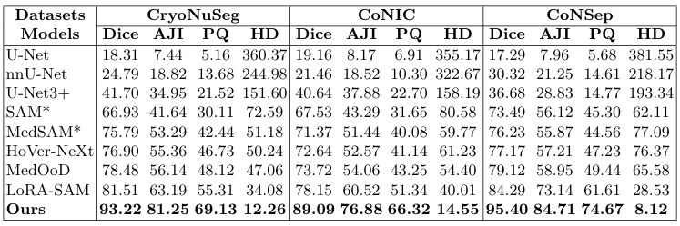

<br/>
<div align="center">
  
</div>

<p align="center">
  <h3 align="center">Out-of-Distribution Nuclei Segmentation in Histology Imaging via Liquid Neural Networks with Modern Hopfield Layer</h3>

  <p align="center">
    Official implementation of the paper published at MICCAI 2025
    <br/>
    <br/>
    <a href="https://github.com/CVPR-KIT/OOD-Nuclei-Segmentation-via-LNNs-with-MHN/issues">Report Bug</a>
  </p>
</p>

</p>

<div align="center">
  <h3> Qualitative Performance Comparison </h3>
  
</div>


<div align="center">
  <h3> Quantitative Performance Comparison </h3>
  
</div>

***

---

## Repository Structure

```
.
├── configs/
│   ├── config.yaml
│   └── readme.md
├── src/
│   ├── data/
│   ├── models/
│   └── utils/
├── weights/
├── augment.py
├── inference.py
├── main.py
├── requirements.txt
├── setup.py
├── LICENSE
└── README.md
```

Additional experiment outputs such as logs, model checkpoints, and visualizations are created automatically during training.

---

## Configuration

All experiment parameters are controlled via Hydra configuration files located in `configs/`.

Configurable aspects include:

- Dataset paths and splits
- Model architecture and feature sizes
- Enabling/disabling LNN, quantization, and Hopfield modules
- Training hyperparameters

Review and modify `configs/config.yaml` before running experiments.

---

## Installation

Clone the repository:

```bash
git clone https://github.com/CVPR-KIT/OOD-Nuclei-Segmentation-via-LNNs-with-MHN.git
cd OOD-Nuclei-Segmentation-via-LNNs-with-MHN
```

Create Env and Install dependencies:

```bash
python -m venv oodNuclei
source oodNuclei/bin/activate # activate environment (may be different for windows)
pip install -e .
```

---

## Training

Run training using:

```bash
python main.py
```

Hydra automatically creates an experiment directory containing logs, model checkpoints, and intermediate outputs.

---

## Inference

To perform inference:

```bash
python inference.py --expt_dir <path_to_experiment_directory>
```

Ensure dataset paths and preprocessing match the training setup.

## Contributing
Contributions are what make the open source community such an amazing place to learn, inspire, and create. Any contributions you make are **greatly appreciated**.

* If you have suggestions for adding or removing projects, feel free to [open an issue](https://github.com/CVPR-KIT/OOD-Nuclei-Segmentation-via-LNNs-with-MHN/issues) to discuss it, or directly create a pull request after editing the README.md file with necessary changes.
* Please make sure you check your spelling and grammar.
* Create individual PRs for each suggestion.

### Creating A Pull Request
1. Fork the Project
2. Create your Feature Branch (`git checkout -b feature/newFeature`)
3. Commit your Changes (`git commit -m 'Added some new feature'`)
4. Push to the Branch (`git push origin feature/newFeature`)
5. Open a Pull Request


## License
Distributed under the MIT License. See [LICENSE](LICENSE) for more information.

## Authors
* [**Bishal Ranjan Swain**](https://github.com/bluesaiyancodes) - PhD Candidate at Kumoh National Institute of Technology

## Acknowledgements
* [Prof. Jaepil Ko](http://cvpr.kumoh.ac.kr/#team)